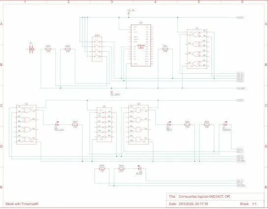
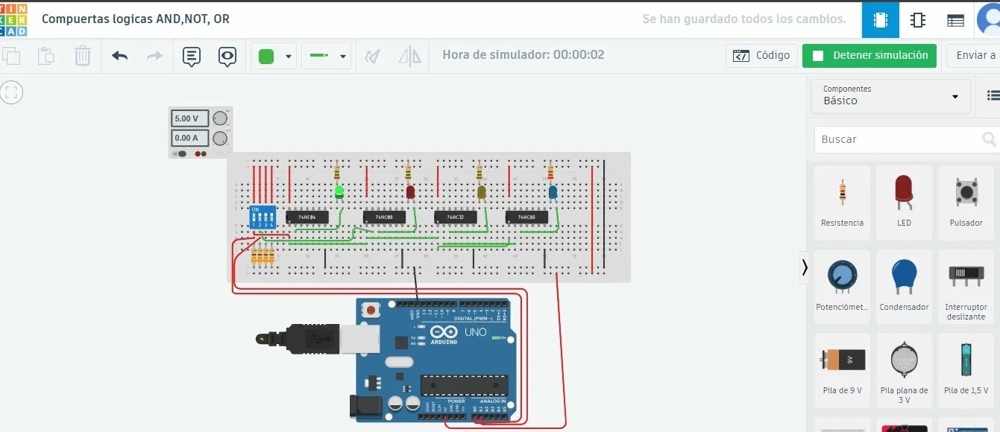
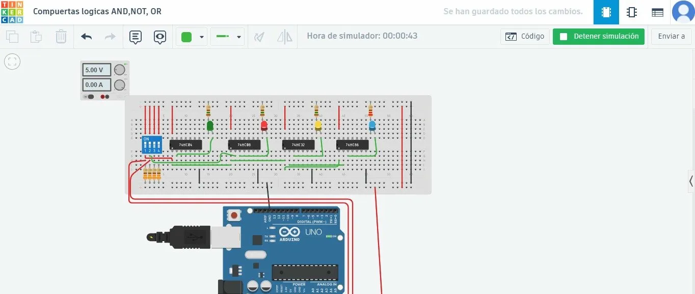
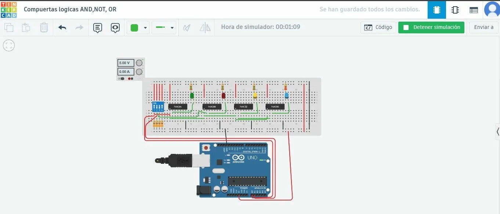
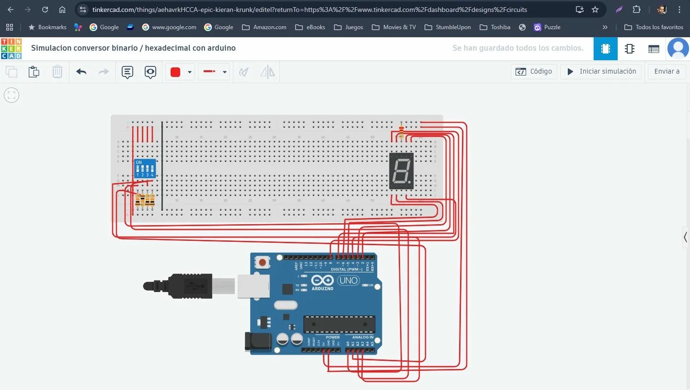
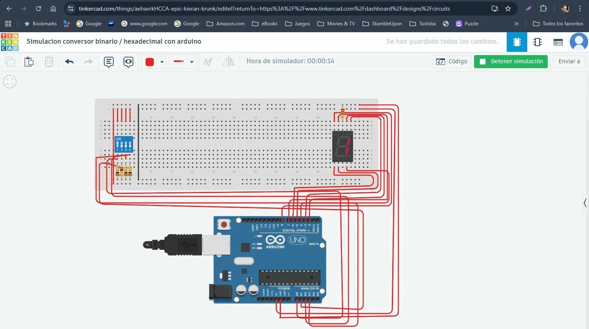
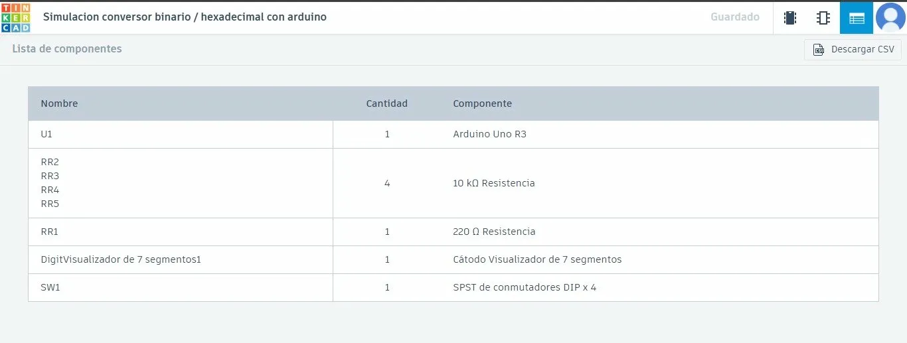
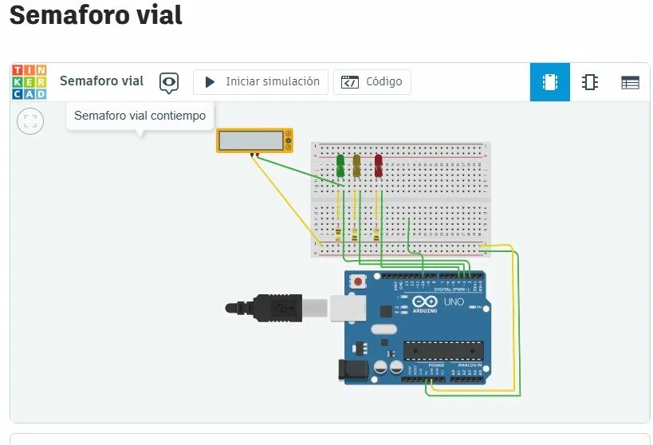
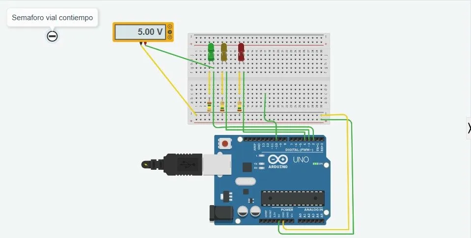
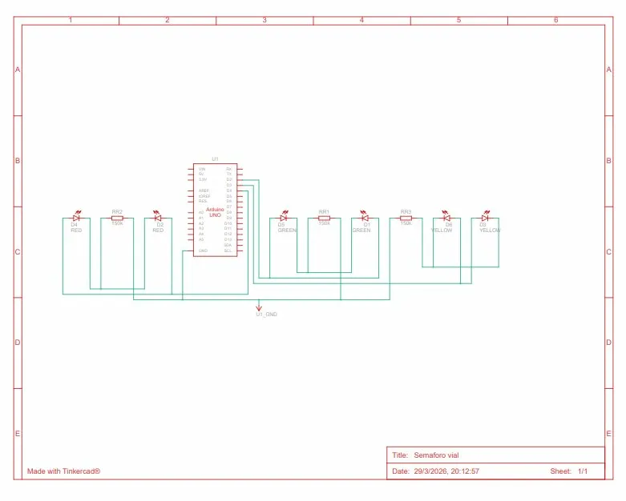

#  Ejercicios con Arduino - Simulación en Tinkercad

Ingeniería de Sistemas  
**Plataforma de simulación:** [Tinkercad](https://www.tinkercad.com)  
**Nombres** Alejandro Angel Jimenez - Jorge Torrenegra Almanza
---
## Punto 1 — Simulación de Compuertas Lógicas (AND, NOT, OR)

### Enlace Tinkercad
[Ver simulación en Tinkercad](https://www.tinkercad.com/things/1rCSZb31InG-mighty-vihelmo-amberis/editel?returnTo=https%3A%2F%2Fwww.tinkercad.com%2Fdashboard)

### Descripción
Simulación del comportamiento de las compuertas lógicas fundamentales AND, OR y NOT mediante chips integrados reales conectados a un Arduino UNO. Las entradas se controlan con un DIP Switch y los resultados se visualizan a través de LEDs y el Monitor Serie.

### Evidencia Punto 1

**Esquemático del circuito:**  


**Circuito en Tinkercad:**  


**Simulación en ejecución:**  
  


### Componentes
| Componente | Cantidad | Función |
|---|---|---|
| Arduino UNO | 1 | Controlador principal / Monitor Serie |
| DIP Switch 4 posiciones | 1 | Entradas A y B |
| 74HC04 | 1 | Compuerta NOT |
| 74HC08 | 1 | Compuerta AND |
| 74HC32 | 1 | Compuerta OR |
| 74HC86 | 1 | Compuerta XOR |
| LEDs (verde, rojo, amarillo, azul) | 4 | Visualización de salidas |
| Resistencias | varias | Protección de LEDs |
| Protoboard | 1 | Montaje del circuito |

### Conexiones
- **Entradas:** DIP Switch → Pines A0 (Entrada A) y A1 (Entrada B) del Arduino
- **Salidas:** Chips 74HC conectados a LEDs para visualizar NOT A, AND, OR y XOR
- **Alimentación:** 5V desde Arduino

### Tabla de Verdad

| A | B | NOT A | AND (A·B) | OR (A+B) |
|:---:|:---:|:---:|:---:|:---:|
| 0 | 0 | 1 | 0 | 0 |
| 0 | 1 | 1 | 0 | 1 |
| 1 | 0 | 0 | 0 | 1 |
| 1 | 1 | 0 | 1 | 1 |

### Código
```cpp
/*
 * EJERCICIO CLASE - PUNTO 1
 * Simulación de las compuertas Lógicas (NOT, AND, OR)
 * Conexión: DIP Switch a pines A0 y A1 del Arduino
 */

const int pinEntradaA = A0;
const int pinEntradaB = A1;

void setup() {
  pinMode(pinEntradaA, INPUT);
  pinMode(pinEntradaB, INPUT);
  Serial.begin(9600);
  Serial.println("--- PRUEBA DE COMPUERTAS LÓGICAS ACTIVA ---");
}

void loop() {
  int A = digitalRead(pinEntradaA);
  int B = digitalRead(pinEntradaB);

  Serial.print("A="); Serial.print(A);
  Serial.print(" | B="); Serial.print(B);
  Serial.print(" || NOT A="); Serial.print(!A);
  Serial.print(" | AND="); Serial.print(A && B);
  Serial.print(" | OR="); Serial.println(A || B);

  delay(250);
}
```

### Explicación
- El Arduino lee el estado digital de A0 y A1 conectados al DIP Switch.
- Calcula en software NOT, AND y OR para mostrarlos en el Monitor Serie.
- Los chips 74HC realizan el cálculo físicamente en el circuito, encendiendo los LEDs correspondientes.

---

## Punto 2 — Conversor Binario a Hexadecimal

### Enlace Tinkercad
[Ver simulación en Tinkercad](https://www.tinkercad.com/things/aehavrkHCCA-epic-kieran-krunk/editel?returnTo=https%3A%2F%2Fwww.tinkercad.com%2Fdashboard%2Fdesigns%2Fcircuits)

### Descripción
Conversión de un número binario de 4 bits (ingresado mediante un DIP Switch) a su representante hexadecimal, visualizado en un display de 7 segmentos de cátodo común. Permite mostrar valores del 0 al F (0–15 en decimal).

### Evidencia Punto 2

**Circuito en Tinkercad:**  


**Simulación en ejecución:**  


**Lista de componentes:**  


### Componentes
| Componente | Cantidad | Función |
|---|---|---|
| Arduino UNO (R3) | 1 | Controlador principal |
| DIP Switch SPST x4 | 1 | Entrada binaria de 4 bits |
| Display 7 segmentos cátodo común | 1 | Salida hexadecimal |
| Resistencia 220 Ω | 1 | Protección del display |
| Resistencias 10 kΩ | 4 | Pull-down para el DIP Switch |
| Protoboard | 1 | Montaje del circuito |

### Conexiones
- **Entradas (DIP Switch):** A0=bit0 (1), A1=bit1 (2), A2=bit2 (4), A3=bit3 (8)
- **Salidas (Display 7 seg):** Segmentos a–g → pines digitales **D2 al D8**

###  Conversión Binario → Hexadecimal

| Binario (A3 A2 A1 A0) | Decimal | Hexadecimal |
|:---:|:---:|:---:|
| 0000 | 0 | 0 |
| 0001 | 1 | 1 |
| 0101 | 5 | 5 |
| 1001 | 9 | 9 |
| 1010 | 10 | A |
| 1011 | 11 | b |
| 1100 | 12 | C |
| 1111 | 15 | F |

### Código
```cpp
/*
 * EJERCICIO CLASE - PUNTO 2
 * Conversor Binario (4 bits) a Hexadecimal (7 Segmentos)
 */

const int segmentos[] = {2, 3, 4, 5, 6, 7, 8};
const int switchPins[] = {A0, A1, A2, A3};

const byte digitosHex[16][7] = {
  {1,1,1,1,1,1,0}, // 0
  {0,1,1,0,0,0,0}, // 1
  {1,1,0,1,1,0,1}, // 2
  {1,1,1,1,0,0,1}, // 3
  {0,1,1,0,0,1,1}, // 4
  {1,0,1,1,0,1,1}, // 5
  {1,0,1,1,1,1,1}, // 6
  {1,1,1,0,0,0,0}, // 7
  {1,1,1,1,1,1,1}, // 8
  {1,1,1,1,0,1,1}, // 9
  {1,1,1,0,1,1,1}, // A
  {0,0,1,1,1,1,1}, // b
  {1,0,0,1,1,1,0}, // C
  {0,1,1,1,1,0,1}, // d
  {1,0,0,1,1,1,1}, // E
  {1,0,0,0,1,1,1}  // F
};

void setup() {
  for (int i = 0; i < 7; i++) pinMode(segmentos[i], OUTPUT);
  for (int i = 0; i < 4; i++) pinMode(switchPins[i], INPUT);
}

void loop() {
  int valorDecimal = 0;
  if (digitalRead(A0) == HIGH) valorDecimal += 1;
  if (digitalRead(A1) == HIGH) valorDecimal += 2;
  if (digitalRead(A2) == HIGH) valorDecimal += 4;
  if (digitalRead(A3) == HIGH) valorDecimal += 8;
  escribirDisplay(valorDecimal);
  delay(150);
}

void escribirDisplay(int index) {
  for (int i = 0; i < 7; i++) {
    digitalWrite(segmentos[i], digitosHex[index][i]);
  }
}
```

### Explicación
- El DIP Switch actúa como número binario de 4 bits. Cada interruptor representa una potencia de 2 (1, 2, 4, 8).
- Se suma el valor de cada bit activo para obtener el número decimal (0–15).
- La función `escribirDisplay()` consulta la matriz `digitosHex` y enciende/apaga cada segmento del display.

---

##  Punto 3 — Semáforo Vial con Tiempos

### 🔗 Enlace Tinkercad
[Ver simulación en Tinkercad](https://www.tinkercad.com/things/id1EKRqjbHu-daring-bruticus-lahdi/editel?returnTo=https%3A%2F%2Fwww.tinkercad.com%2Fdashboard%2Fdesigns%2Fall)

### Descripción
Simulación de un semáforo vial con tres LEDs (Verde, Amarillo, Rojo) que ciclan automáticamente respetando tiempos predefinidos para cada fase, con salida por Monitor Serie para seguimiento del estado actual.

###  Evidencia Punto 3

**Circuito en Tinkercad:**  


**Simulación en ejecución:**  


**Esquemático del circuito:**  


### Componentes
| Componente | Cantidad | Función |
|---|---|---|
| Arduino UNO | 1 | Controlador principal |
| LED Verde | 1 | Fase: Avanzar |
| LED Amarillo | 1 | Fase: Precaución |
| LED Rojo | 1 | Fase: Detener |
| Resistencias 150 Ω | 3 | Protección de LEDs |
| Protoboard | 1 | Montaje del circuito |

### Conexiones
| LED | Pin Arduino |
|---|---|
| Verde | D2 |
| Amarillo | D3 |
| Rojo | D4 |

### Tiempos de Fase
| Fase | Color | Duración |
|---|---|---|
| Avanzar | 🟢 Verde | 5 segundos |
| Precaución | 🟡 Amarillo | 2 segundos |
| Detener | 🔴 Rojo | 5 segundos |

### Código
```cpp
/*
 * EJERCICIO CLASE - PUNTO 3
 * Semáforo Vial con Tiempos
 */

const int ledVerde    = 2;
const int ledAmarillo = 3;
const int ledRojo     = 4;

const unsigned long tiempoVerde    = 5000;
const unsigned long tiempoAmarillo = 2000;
const unsigned long tiempoRojo     = 5000;

void setup() {
  pinMode(ledVerde, OUTPUT);
  pinMode(ledAmarillo, OUTPUT);
  pinMode(ledRojo, OUTPUT);
  Serial.begin(9600);
  Serial.println("--- Semáforo Iniciado ---");
}

void loop() {
  Serial.println("🟢 Estado: VERDE → Avanzar");
  digitalWrite(ledVerde, HIGH);
  digitalWrite(ledAmarillo, LOW);
  digitalWrite(ledRojo, LOW);
  delay(tiempoVerde);

  Serial.println("🟡 Estado: AMARILLO → Precaución");
  digitalWrite(ledVerde, LOW);
  digitalWrite(ledAmarillo, HIGH);
  digitalWrite(ledRojo, LOW);
  delay(tiempoAmarillo);

  Serial.println("🔴 Estado: ROJO → Detener");
  digitalWrite(ledVerde, LOW);
  digitalWrite(ledAmarillo, LOW);
  digitalWrite(ledRojo, HIGH);
  delay(tiempoRojo);
}
```

### Explicación
- Se definen constantes para pines y tiempos, facilitando modificaciones futuras.
- El `loop()` implementa la secuencia Verde → Amarillo → Rojo de forma cíclica e infinita.
- `delay()` pausa la ejecución el tiempo exacto de cada fase.
- El Monitor Serie permite verificar en qué fase se encuentra el semáforo.

---

## Conceptos Clave

- **Compuertas lógicas:** Operaciones booleanas básicas de la electrónica digital (AND, OR, NOT).
- **Binario a hexadecimal:** 4 bits representan un dígito hexadecimal (0–F).
- **Display 7 segmentos:** Muestra dígitos activando combinaciones de 7 LEDs internos.
- **Semáforo con `delay()`:** Control temporal secuencial básico en sistemas embebidos.

---

